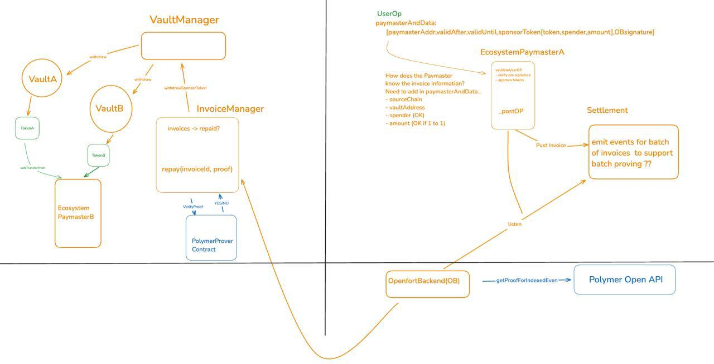
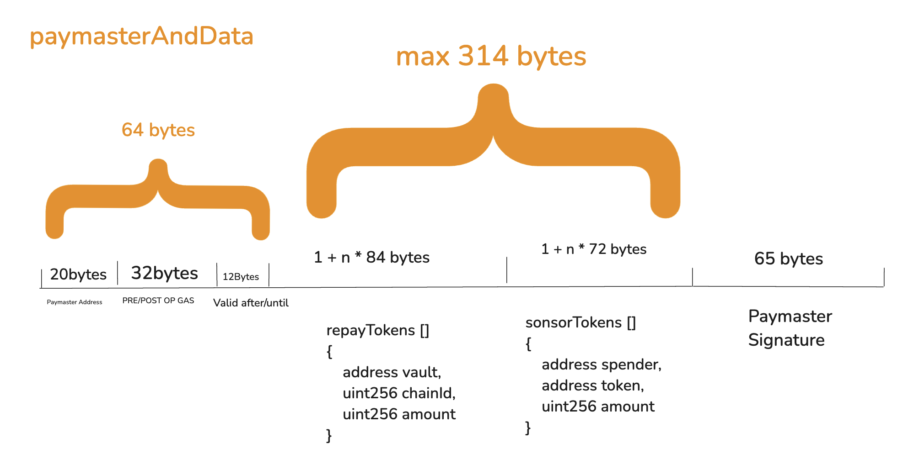

# Openfort Ecosystem Abstraction

## Overview
Ecosystems are parent entities for groups of apps operating across different blockchains or standalone layer 2 networks. Openfort [**ecosystem wallets**](https://www.openfort.xyz/docs/guides/ecosystem) enable seamless interoperability between applications, allowing ecosystems to design their ideal, unified wallet experience. The next evolution is consolidating user liquidity across apps, providing a single, unified balance instantly spendable across the ecosystem. This vision will be powered by Openfort's chain abstraction implementation of [MagicSpend++](https://ethresear.ch/t/magicspend-spend-now-debit-later/19678/9) hosted in this repository.

With this setup, ecosystems can deploy tailor-made 4337 chain abstraction infrastructure.
They become Liquidity Providers (LPs) for their users, sharing with them the value that would otherwise have been captured by solvers/fillers.
They own their users' experience from the wallet to the chain.

## System Architecture

## Zoom on userOp paymasterAndData

## System Components

### Time-locked Vault
- Tokenized Vaults with a single underlying EIP-20 token
- *not* [4626](https://eips.ethereum.org/EIPS/eip-4626) compliant (does *not* implement EIP-20 to represent shares)
- only the VaultManager can interact with the Vault
- Define locking period when initialiaing the vault
- Deploy on any supported source chains
- Can be yield-bearing (e.g deposit to Aaver or Morpho)

_Note:_ "locking" can be simplified into a **SEND** transaction from an EOA to the Smart Contract Account. A backend watcher listens for `received` events and automatically lock the funds (i.e., transfer them to the time-locked vault). This approach requires users to sign a session key for the watcher service.

### Vault Manager
- Manage Vaults
- Manage withdrawals and deposits

### Invoice Manager
- Settlement of invoices
- Prevent double-repayment of invoices with state proof verification
- authorize paymasters and paymaster verifiers

### Chain Abstraction Paymaster (CABPaymaster)

The CABPaymaster fronts funds on the destination chain for the user if they _HAVE_ enough locked balance (checked by Openfort Backend).

The Paymaster contract will get repaid on the source chain(s). Ni1o: user has 100@A, 50@B, and spends 130@C

- Set/update the Paymaster owner address (ecosystem *MUST* own the Paymaster)
- Fund/withdraw Paymaster balance (Openfort crafts the transaction, but the ecosystem owner _MUST_ sign it)
- Ragequit > owner withdraw all funds from all Paymasters with one signature

Paymaster Owner can subscribe to webhook alerts when the Paymaster balance falls below a certain threshold, before automatic rebalancing is implemented.

### Paymaster Verifiers
- Permissionless verification of remote event (InvoiceCreated) or storage proof (invoices mapping in the invoiceManager)
- Permissionless verification of invoice

As part of chain abstraction activation, an account registers a Paymaster Verifier, which is subsequently called by the InvoiceManager before processing repayments.

One of the system’s key strengths is its modular approach to proof verification. We envision a future where state proofs play a crucial role in Ethereum interoperability, with more proof providers emerging. Our design allows for seamless integration of new proof verification strategies, giving advanced users the flexibility to choose the one that best suits their use case.

## Trust assumptions

* The system relies on cross-L2 execution proofs enabled by [Polymer](https://docs.polymerlabs.org/docs/build/examples/chain_abstraction/), eliminating the need for Users to trust Openfort or the Ecosystem. To recover funds locked in source chain vaults on behalf of the ecosystem, Openfort must prove the execution of the userOp on the remote chain. There is no refund on source chain without the corresponding remote chain execution proof. The InvoiceManager tracks invoices onchain to prevent double-refund.
* The system supports [Hashi](https://crosschain-alliance.gitbook.io/hashi/introduction/what-is-hashi) as a fallback proving mechanism if Polymer or Openfort cease operations. Liquidity providers (LPs) can generate a proof for their fronted funds by running a [Hashi RPC API locally](https://github.com/gnosis/hashi/tree/main/packages/rpc#getting-started) and submit it to `fallbackRepay` along with the invoice. This enables refunds using only public data, without relying on any third party. Note that the fallback proving strategy might evolve in the future but will always remain permissionless.
* Openfort does not have custody of funds in the Ecosystem Paymaster because the userOp is co-signed within a secure enclave executing predefined policies set by the ecosystem. At any time, the ecosystem can disable a signer to immediately block any new userOp from being sent.

## Deployments

- One InvoiceManager owned by Openfort
- One VaultManager onwed by Openfort
- One CABPaymaster per Ecosystem and Owned by the Ecosystem
- All Vaults are owned by Openfort
- All Paymaster Verifiers

Check latest deployment of the [demo cli](demo/constants.ts).
