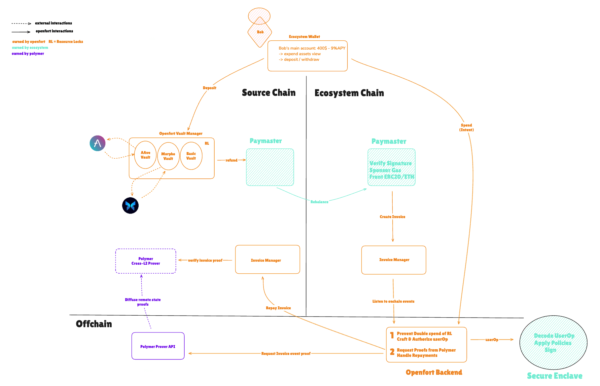

# Openfort Ecosystem Abstraction

## Overview

Ecosystems are parent entities for groups of apps operating on different blockchains or standalone layer 2 networks. Openfort [**ecosystem wallets**](https://www.openfort.xyz/docs/guides/ecosystem) enable seamless interoperability between applications, allowing ecosystems to design their ideal, unified wallet experience. The next evolution is consolidating user liquidity across blockchains, providing a single, unified balance instantly spendable throughout the ecosystem. This vision will be powered by Openfort's chain abstraction implementation of [MagicSpend++](https://ethresear.ch/t/magicspend-spend-now-debit-later/19678/9) hosted in this repository.

With this setup, ecosystems can deploy tailor-made 4337 chain abstraction infrastructure.
They become Liquidity Providers (LPs) for their users, sharing with them the value that would otherwise have been captured by solvers/fillers.
They own their users' experience from the wallet to the chain.

## System Architecture

Chain abstraction relies on resource locks to function effectively. In such systems, a third-party fronts fund and resource locks are counterparty guarantees, ensuring that liquidity providers (LPs) are refunded. There are many different ways to implement resource locks. Should the asset be locked in the account smart contract or a dedicated vault contract? Should users lock before every transaction for a short time, or lock once in a while?

In this system, locking is a one-time action, similar to having a spending account that generates yield and can be used across various platforms. The yield is enabled because resources are locked in dedicated vaults with different strategies.

With Openfort, the ecosystem itself serves as the third-party LP. Leveraging the ecosystem wallet, all apps within the ecosystem can detect the user’s locked balance, allowing for seamless token spending at the speed of the destination chain.

## Zoom on the UserOperation paymasterAndData field

According to the Account Abstraction [ERC-4337](https://eips.ethereum.org/EIPS/eip-4337) specification, <em>when the paymasterAndData field in the `UserOperation` is not empty, the `EntryPoint` implements a different flow for that `UserOperation`</em> to call the Paymaster before and after the `UserOperation` execution. We use this field to encode the repayment token paths - previously signed by the user as an [EIP-712](https://github.com/ethereum/EIPs/blob/master/EIPS/eip-712.md) message - along with the sponsor tokens (i.e., the tokens being fronted). Additionally, it includes the ecosystem's signature, which authorizes the `UserOperation` and is verified onchain by the CABPaymaster in the `validatePaymasterUserOp` hook.

Note: the system supports native token, represented as `0xEeeeeEeeeEeEeeEeEeEeeEEEeeeeEeeeeeeeEEeE`, following the [ERC-7528](https://eips.ethereum.org/EIPS/eip-7528) native asset convention.

## System Components

### Time-locked Vault
- Tokenized Vaults with a single underlying EIP-20 token
- *Not* [4626](https://eips.ethereum.org/EIPS/eip-4626) compliant (does *not* implement EIP-20 to represent shares)
- Only the VaultManager can interact with the Vault
- Define locking period when initializing the Vault
- Deploy on any supported source chains
- Can be yield-bearing (e.g deposit to Aave or Morpho)

_Note:_ "Locking" can be simplified into a *SEND* transaction from an EOA to the Smart Contract Account. A backend watcher listens for received events and automatically transfers the funds to a time-locked vault. This process requires users to sign a session key for the watcher service.

### Vault Manager
- Manage Vaults
- Manage withdrawals and deposits

### Invoice Manager
- Settlement of invoices
- Prevent double-repayment of invoices with state proof verification
- authorize paymasters and paymaster verifiers

### Chain Abstraction Paymaster (CABPaymaster)

The CABPaymaster fronts funds on the destination chain for the user if they _HAVE_ enough locked balance (checked by Openfort Backend).

The Paymaster contract will get repaid on the source chain(s). Ni1o: user has 100@A, 50@B, and spends 130@C

- Set & update the Paymaster owner address (ecosystem *MUST* own the Paymaster)
- Withdraw Paymaster balance (Openfort crafts the transaction, but the ecosystem owner *MUST* sign it)
- Ragequit > owner withdraw all funds from all Paymasters with one signature

Paymaster Owner can subscribe to webhook alerts when the Paymaster balance falls below a certain threshold, before automatic rebalancing is implemented.

### Paymaster Verifiers
- Permissionless verification of remote event (`InvoiceCreated`) or storage proof (`invoices` mapping in the `InvoiceManager`)
- Permissionless verification of invoice

As part of chain abstraction activation, an account registers a Paymaster Verifier, which is subsequently called by the `InvoiceManager` to unlock repayments.

## Trust assumptions

- The system relies on cross-L2 execution proofs currently provided by [Polymer](https://docs.polymerlabs.org/docs/build/examples/chain_abstraction/), eliminating the need for users to trust Openfort or the Ecosystem. To repay the ecosystem on the source chain(s) with user assets locked in vaults, Openfort must prove the execution of the `UserOperation` on the destination chain. No refund occurs on the source chain without a corresponding execution proof on the remote chain. The `InvoiceManager` tracks invoices onchain to prevent double-refund.
- The system supports [Hashi](https://crosschain-alliance.gitbook.io/hashi/introduction/what-is-hashi) as a fallback proving mechanism if Polymer or Openfort ceases operations. Liquidity providers (LPs) first generate a proof for their fronted funds by running a [Hashi RPC API locally](https://github.com/gnosis/hashi/tree/main/packages/rpc#getting-started), which conveniently wraps [eth_getProof](
https://github.com/ethereum/EIPs/issues/1186) for storage proofs or `eth_getTransactionReceipt` for events proof in the receipt trie.
Then, they call the `fallbackRepay` function of the `InvoiceManager` with the proof and the invoice. This enables refunds solely using public data, without relying on any third party. The fallback proving strategy may evolve, but it will always remain permissionless, as it ultimately determines the system's overall security.
- Openfort does not have custody of funds in the Ecosystem Paymaster, as the `UserOperation` is co-signed within a secure enclave that enforces predefined policies set by the ecosystem. At any time, the ecosystem can disable a signer, immediately preventing any `UserOperation` from being sent.

A key strength of the system is its modular approach to proof verification. With Ethereum interoperability advancing, more proof providers will emerge. The system’s design allows for seamless integration of new proof verification strategies, giving advanced users the flexibility to select the best fit for their use case. Polymer offers cheap and extremely fast proofs but requires trust in [sequencers](https://docs.polymerlabs.org/docs/learn/intro), whereas Hashi leverages multiple independent oracles to validate, verify, and relay block headers across different blockchains.

The trade-off is between trustlessness and efficiency. Hashi prioritizes decentralization but incurs higher gas costs due to its thorough verification process, with block headers taking up to 24 hours to become available. This makes it a perfect fallback repayment methods but not a serious candidat for real world interop use cases. In contrast, Polymer is optimized for efficiency with near block time proof availability (2-3 seconds), making it the preferred choice for day-to-day operations. Over time, this trade-off may become more nuanced and users will be able to fine-tune the system according to their preferences.

## Deployments

- One `InvoiceManager` owned by Openfort
- One `VaultManager` owned by Openfort
- One `CABPaymaster` per Ecosystem and Owned by the Ecosystem
- All vaults owned by Openfort
- All `Paymaster Verifiers`

Check latest deployments in the [demo cli](demo/constants.ts).

Curious about how it all came together? [Watch the full demo and dev story on YouTube](https://www.youtube.com/watch?v=L0Jmdw_XQX0).
